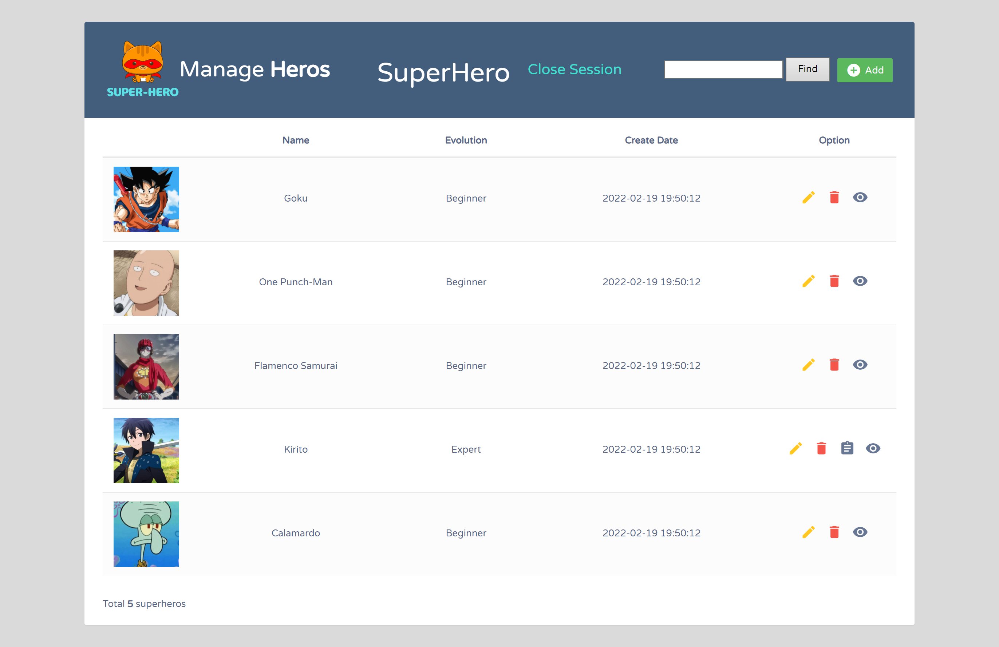
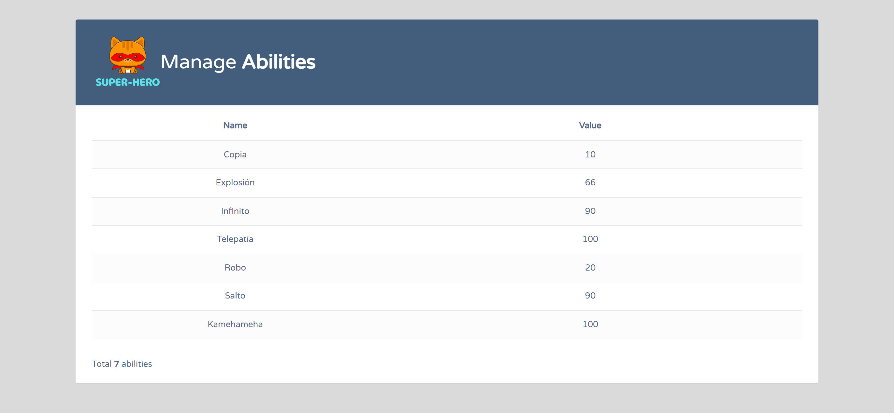
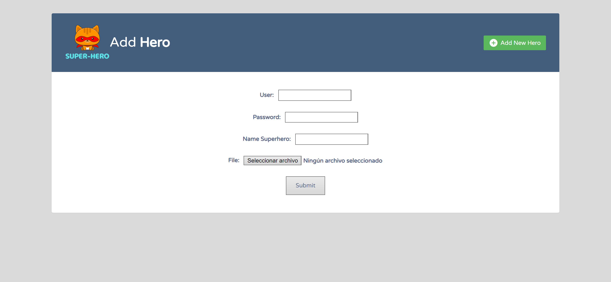
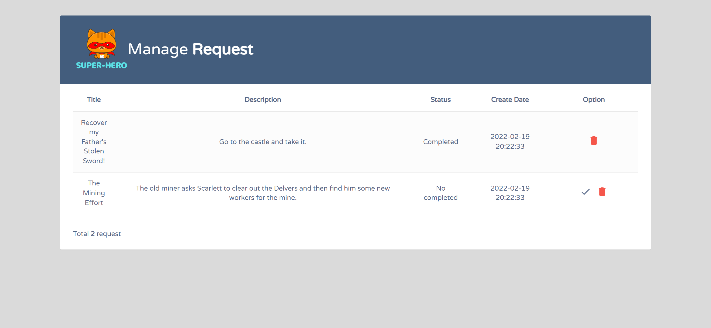

# CRUD Super Hero

## BD db_superheros.sql

## Users and Passwords examples
| Cityzens      | Superhero | Superhero Expert |
| ----------- | ----------- | ----------- |
| dani / dani | bart / bart | toret / toret
| antonio / antonio | xmaadix / xmaadix | carola / carola

## Redirección 
127.0.0.1 superheros.local

## VirtualHost
    <VirtualHost *>
        DocumentRoot "C:/xampp/htdocs/dws/superheros/public/"
        ServerName superheros.local 
        <Directory "C:/xampp/htdocs/dws/superheros/public/">
            Options All 
            AllowOverride All
            Require all granted
        </Directory>
    </VirtualHost>

## Index

## Habilities

## Add-Hero

## Request
